<div align="center">

# Hey, I'm Martin 👋

**Freelance Creative Developer** — Video · Design · Web · Hardware

I build things that look good and work even better.

<a href="https://klipni.eu" target="_blank">
  
</a>


</div>

<p align="center">
  
</p>

---

### 🧍 About Me

I'm a self-taught creative developer from the Czech Republic 🇨🇿 who bridges the gap between visual design and code. I run my own freelance business and I'm always looking for interesting projects to collaborate on.

- 🎬 **Video & Motion** — Editing commercials, social content, and motion graphics
- 🎨 **Graphic Design** — Brand identity, logos, print, and social media assets
- 🌐 **Web Development** — Custom websites and web apps from scratch
- ⚡ **Hardware & IoT** — Arduino, ESP32, Raspberry Pi projects
- 📫 **Contact** — [martinsramek040707@gmail.com](mailto:martinsramek040707@gmail.com)

---

### 🛠️ Tech Stack

<div align="center">

**Video & Design**


**Web Development**


**Hardware & Tools**


</div>

---

### 📂 Featured Projects

| Project | Description | Tech |
|:--------|:------------|:-----|
| [🎬 klipni.eu](https://klipni.eu) | SaaS platform for video editing services | Laravel, JS |
| [🔌 FLOW](https://github.com/martinsram3k/FLOW) | Custom macro keyboard with programmable keys | C, Hardware |
| [⌨️ Macropad Configurator](https://github.com/martinsram3k/macropad_configurator) | Web-based configurator for custom macropads | JavaScript |
| [🍎 LidMonitor](https://github.com/martinsram3k/LidMonitor) | Automatic MacBook lid state monitor with sleep & brightness control | Shell |
| [⏰ Node-Smart-Clock](https://github.com/martinsram3k/Node-Smart-Clock) | Smart clock built on custom hardware | C, Arduino |
| [🌡️ ESP32 Fan Control](https://github.com/martinsram3k/eps32_fan_controll) | Temperature-based automatic fan controller | C++, ESP32 |
| [🪞 Smart Mirror](https://github.com/martinsram3k/Raspberry_Pi_smart_mirror) | Raspberry Pi powered smart mirror | Python, RPi |

---

### 💼 How I Work

```
1. You tell me what you need
2. I send you a clear quote within 24 hours
3. We agree on scope & timeline
4. I deliver — you review — we iterate
5. Final handoff with all source files
```

> I work directly with you — no middlemen, no corporate overhead.
> Fast communication, honest pricing, quality output.

---

### 🌐 Let's Connect

<p align="center">
  <a href="https://instagram.com/martin.sram3k"></a>
  <a href="https://tiktok.com/@martin.sram3k"></a>
  <a href="https://youtube.com/@@production_faf"></a>
  <a href="https://pinterest.com/production_faf"></a>
</p>

---

<div align="center">

**☕ Support my work**

<a href="https://buymeacoffee.com/martin.sram3k"></a>
<a href="https://paypal.me/@marti842"></a>

<br><br>


</div>
